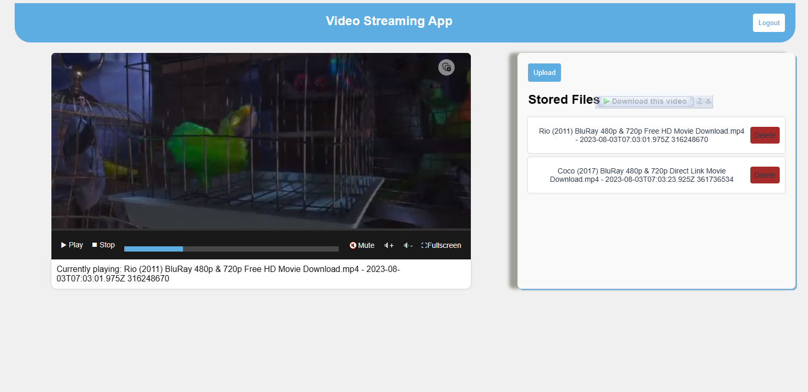
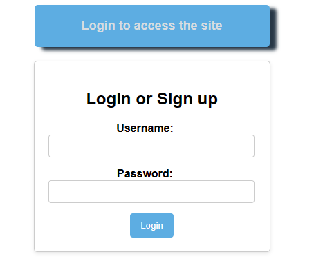

# Video Streaming App

## 📜 Description:
A video streaming app that allows users to upload and watch. The app is built using NodeJS, Express, MongoDB, and Redis.
## 🕸 Technology Stack:
- Express {Middleware: body-parser, helmet, cookie-parser}
- HTML
- JWT
- MongoDB
- NodeJS
- TypeScript
- Redis
## 🌟 Features:
- User can upload videos
- User can watch videos
- Fully Authenticated (Login, Logout)
## 📷 Screenshots:
While the app is running

Login Page  
  
 
## 📽 Demo:  
<!-- Gif Video https://i.imgur.com/578nOVk.gifv -->  
  
## 📝 Instructions to run locally:
- Pre-requisites:
	-  MongoDB
	-  NodeJS
	-  Redis
- Directions to install dependencies and run locally:
```bash
$ git clone https://github.com/robelandro/Video_Streaming_App.git
$ cd
$ npm install
$ npm run build-and-run
```

## 👨‍💻 Author:
[Nftalem Arega](https://github.com/robelandro)
